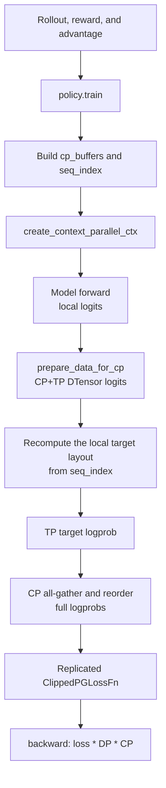
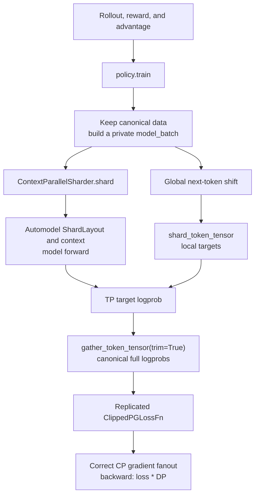
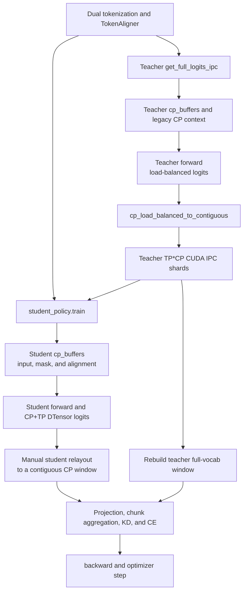
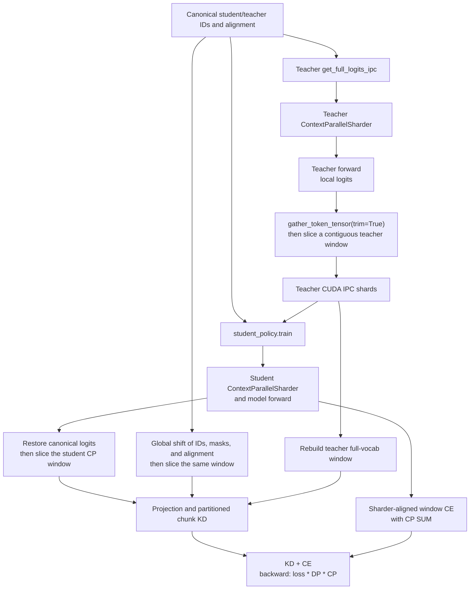

# Automodel v0.6.0 and Context-Parallel Integration

This design note describes NeMo RL's Automodel DTensor v2 integration after the
Automodel dependency was pinned to the official `v0.6.0` tag. It also explains the
migration from NeMo RL's fixed context-parallel (CP) layout to Automodel's model-owned
sharding protocol.

## 1. Scope and Baselines

The before-and-after comparisons in this document use the following fixed baselines:

| Baseline | NeMo RL revision | Automodel revision |
| --- | --- | --- |
| Before the upgrade | `13b9dae09c31d9069575ce24de1e234943da7b92` | `24b47e856263d313b942f0ed666c63fff83306b4` from `main`; package version `0.4.0` |
| After the upgrade | This integration | [`v0.6.0`](https://github.com/NVIDIA-NeMo/Automodel/tree/v0.6.0) at `89c248a1743b47e135bab5a3e08856d2e24f3bd3` |

The support matrices below describe the **NeMo RL Automodel integration**, not every
capability available in upstream Automodel. In particular, a model or layout can be
supported upstream while still being rejected by a NeMo RL worker guard. "Supported"
means that the NeMo RL path implements CP and does not explicitly reject the combination;
it does not mean that every model, topology, and sequence length has been tested.

## 2. Automodel v0.6.0 Upgrade

### 2.1 Submodule and Environment

The submodule now records the exact commit referenced by the `v0.6.0` tag instead of
tracking Automodel's moving `main` branch. Moving or recreating the upstream tag does not
change an existing checkout automatically; NeMo RL must explicitly update its gitlink to
adopt a different commit.

The dependency changes in `pyproject.toml` are:

| Dependency | Before | After |
| --- | --- | --- |
| Base `transformers` constraint | `>=5.5.0,<5.9.0` | `>=5.5.0,<=5.12.1` |
| Automodel extra | `transformers>=5.5.0,<5.6.0` | `transformers==5.12.1` |
| FSDP, vLLM, and MCore extras | No direct Transformers pin | `transformers==5.12.1` |
| Automodel TileLang dependency on Linux x86_64 | No Automodel-specific pin | `tilelang==0.1.11` |
| Shared `apache-tvm-ffi` override | `>=0.1.9` | `==0.1.11` |
| `megatron-fsdp` | No root constraint | Git constraint at [`455389c4`](https://github.com/yuhezhang-ai/Megatron-LM/commit/455389c480af6b3acdca74c7830c68b3274eb083) |

The Automodel, FSDP, vLLM, and MCore environments select Transformers 5.12.1. The SGLang
extra remains independently pinned to Transformers 5.6.0. The `megatron-fsdp` constraint
mirrors Automodel's source and revision so `uv` can resolve the transitive URL dependency
consistently. The lock file was regenerated as part of the dependency upgrade.

Automodel's TileLang kernels also require the 0.1.11 TVM FFI ABI. In the container,
`z3/lib` is added to `LD_LIBRARY_PATH` because TileLang's symlinked worker-venv layout can
otherwise prevent `libtvm_compiler.so` from finding `libz3.so`.

### 2.2 Distributed Setup and Model Loading

Automodel v0.6.0 consolidates distributed setup and model loading:

| Area | Before | After |
| --- | --- | --- |
| Device mesh | `create_device_mesh(...)` | `MeshContext.build(FSDP2Config, ParallelismSizes, ...)` |
| Model loading | Separate mesh, FSDP, MoE, and activation-checkpointing arguments | One `DistributedSetup` passed to `from_pretrained()` |
| FSDP backend | `FSDP2Config(backend="nccl")` | No `backend` field; NeMo RL initializes the process-group backend separately |
| MoE config import | `components.moe.config` | `components.distributed.config` |

The main upstream API change is Automodel
[#2266](https://github.com/NVIDIA-NeMo/Automodel/pull/2266):

```python
mesh_context = MeshContext.build(
    fsdp2_config,
    ParallelismSizes(tp_size=tp_size, cp_size=cp_size, ep_size=ep_size),
    world_size=world_size,
)

distributed_setup = DistributedSetup(
    mesh_context=mesh_context,
    strategy_config=fsdp2_config,
    pipeline_config=None,
    moe_parallel_config=moe_config if ep_size > 1 else None,
    activation_checkpointing=activation_checkpointing,
)

model = model_class.from_pretrained(
    model_name,
    distributed_setup=distributed_setup,
    # Other model arguments remain unchanged.
)
```

### 2.3 Other API and Compatibility Changes

- `BackendConfig` now comes from `components.models.common.utils`
  ([#1172](https://github.com/NVIDIA-NeMo/Automodel/pull/1172)).
- `Checkpointer._should_write_hf_metadata()` became the module-level
  `_should_write_hf_metadata(config)`.
- `save_consolidated` now uses `SaveConsolidatedMode`; NeMo RL normalizes values with
  `_normalize_save_consolidated()` after configuration updates
  ([#2289](https://github.com/NVIDIA-NeMo/Automodel/pull/2289)). NeMo RL currently rejects
  `save_consolidated: final` because its checkpoint calls do not identify the final save;
  use `true`/`every` when inline consolidated export is required.

The upgrade removes three compatibility workarounds:

- NeMo RL now imports Automodel's exported `NeMoAutoModelForTokenClassification` instead
  of maintaining a local shim
  ([#1634](https://github.com/NVIDIA-NeMo/Automodel/pull/1634)).
- The `_restore_loaded_model_dtype()` monkeypatch is no longer needed because Automodel
  preserves an explicitly requested FP32 parameter dtype
  ([#2419](https://github.com/NVIDIA-NeMo/Automodel/pull/2419)).
- The Gemma 4 KV-sharing `use_cache=True` workaround is removed. Transformers 5.12.1
  contains the required fix, so Automodel training continues with `use_cache=False`
  ([Transformers #45312](https://github.com/huggingface/transformers/pull/45312)).

## 3. Context-Parallel Integration

### 3.1 Model-Owned Sharding

Automodel [#2937](https://github.com/NVIDIA-NeMo/Automodel/pull/2937) unifies CP input
handling across model families and attention backends through `ContextParallelSharder`:

```python
cp_sharder = ContextParallelSharder(model, device_mesh, batch)
train_ctx, sharded_batch = cp_sharder.shard(batch)

with train_ctx():
    output = model(**sharded_batch)
```

`shard()` selects the model- and backend-specific strategy, pads and shards the batch,
returns the forward context, and stores the resulting `ShardLayout` on
`cp_sharder.shard_layout`. The layout records how local tokens map to global positions and
the sequence lengths before and after padding. The sharder then exposes
`shard_token_tensor()` and `gather_token_tensor()` so callers can map targets, masks,
logprobs, and logits through the exact layout used by the forward pass.

Automodel therefore owns the model-input layout and attention communication. NeMo RL keeps
canonical, unsharded algorithm data and uses the sharder to compute losses or restore
public outputs such as full-sequence logprobs and top-k logits.

### 3.2 Support Matrix Before the Upgrade

This matrix describes the NeMo RL tree at the before-upgrade baseline.

| Scope | Status | Boundary |
| --- | --- | --- |
| Text-only causal LMs without an explicit guard | Supported | Used NeMo RL's fixed head-tail round-robin layout and required a CP-compatible attention path |
| VLMs | Not supported | Model setup and batch handling rejected multimodal input with `CP>1` |
| GRPO and DAPO | Supported | Policy forward, loss, logprob, and logits post-processing had legacy CP paths |
| SFT | Supported | Reused the generic policy loss path |
| DPO | Supported | Restored full-sequence policy and reference logprobs before the DPO loss |
| Same-tokenizer distillation | Supported | Teacher top-k export and student distillation loss were CP-aware |
| X-token distillation | Conditional | Specialized heterogeneous teacher/student TP and CP path; no sequence packing |
| PPO | Not supported end to end | Actor policy could use CP, but the Automodel DTensor critic/value path required `CP=1` |
| Reward-model training | Not supported | The Automodel DTensor RM path rejected `CP>1` |
| CP with sequence packing | Not supported | Explicit NeMo RL guard |
| CP with DTensor sequence parallel | Not supported | Explicit guard when TP sequence parallelism and CP were both active |
| Non-packed sequence length | Restricted | Legacy load-balanced sharding required divisibility by `2 * cp_size` |

### 3.3 Support Matrix After the Upgrade

This matrix describes the current NeMo RL integration pinned to Automodel `v0.6.0`.

| Scope | Status | Boundary |
| --- | --- | --- |
| Text-only causal LMs without an explicit guard | Conditional | Uses the sharder selected by the model and attention backend; support still depends on that strategy being CP-capable |
| VLMs | Not supported in NeMo RL | NeMo RL still rejects VLM training with `CP>1`, even where upstream Automodel has VLM CP hooks |
| GRPO and DAPO | Supported | Canonical full-sequence loss/logprob path; replicated losses use effective backward scaling of `loss * DP` |
| SFT | Supported | Uses the canonical policy loss path and the same replicated-loss fanout correction |
| DPO | Supported | Full-sequence policy/reference logprobs are restored through the sharder before loss computation |
| Same-tokenizer distillation | Supported | Top-k and student outputs are restored through the sharder; replicated loss uses `loss * DP` |
| X-token distillation | Conditional | Specialized heterogeneous TP/CP path remains; no sequence packing, and each teacher/student sequence length must be divisible by its own CP size for the contiguous IPC windows |
| PPO | Not supported end to end | Actor policy can use CP, but the Automodel DTensor critic/value path still requires `CP=1` |
| Reward-model training and scoring | Not supported | RM setup and `ScorePostProcessor` reject `CP>1` |
| CP with sequence packing | Not supported in NeMo RL | The integration still rejects it, even though the upstream sharder can represent packed/THD layouts |
| CP with DTensor sequence parallel | Not supported | The existing TP sequence-parallel guard remains |
| Non-packed sequence length | Supported with padding | The generic sharder pads and trims automatically; x-token keeps the divisibility restriction described above |

### 3.4 GRPO Workflow Before and After

The GRPO algorithm remains unchanged. The refactor changes how `policy.train()` and
`policy.get_logprobs()` map between canonical RL data and the model's local CP layout.

#### Before



NeMo RL implemented the layout twice: once for the model input and again for targets and
logprobs. This coupled the loss path to Automodel's legacy round-robin assumptions.

#### After



| Key change | Before | After |
| --- | --- | --- |
| Layout owner | Automodel and NeMo RL both encoded the layout | Automodel owns `ShardLayout` |
| Data boundary | `cp_buffers` could mutate loss-side tensors in place | Canonical data stays unchanged; only `model_batch` is sharded |
| Target/result mapping | Manual `seq_index` and CP collectives | Sharder token operations |
| Backward scale | Fixed `loss * DP * CP` | CP fanout is removed; GRPO uses `loss * DP` |

For `CP=1`, the worker keeps the direct fast path without constructing a sharder.

### 3.5 X-Token Distillation Workflow Before and After

The outer algorithm is unchanged: tokenize and align fixed text, export teacher full-vocab
logits over CUDA IPC, then compute projection-based KD and student CE. The refactor changes
how teacher and student model layouts are converted into the contiguous windows required by
the IPC and alignment contracts.

#### Before



Teacher export, student relayout, and alignment localization all depended on the fixed
legacy layout.

#### After



| Key change | Before | After |
| --- | --- | --- |
| Teacher IPC window | Manual legacy relayout | Sharder gather, trim, then contiguous slice |
| Student loss window | Rebuilt from CP DTensor assumptions | Restored from the actual `ShardLayout` |
| Alignment | Student fields traveled through `cp_buffers` | Canonical fields are globally shifted, then sliced |
| Preserved x-token logic | CUDA IPC, heterogeneous TP/CP, projection, chunk alignment, and multi-teacher aggregation | Unchanged; these remain NeMo RL responsibilities |

X-token KD and CE keep a partitioned gradient contract, so `cp_gradient_fanout=1` and the
effective backward scale remains `loss * DP * CP`. This differs from GRPO's replicated
full-sequence loss.
