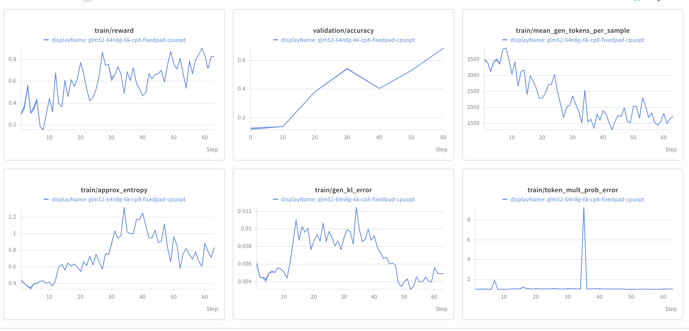

# GLM-5.1 and GLM-5.2

This guide summarizes GLM-5.1 and GLM-5.2 support in NeMo RL, including the
validated GRPO configurations, required Megatron and vLLM configs, supported
DeepSeek Sparse Attention kernel backends, reference training curves,
and known limitations.

The key architecture difference is GLM-5.2's
[IndexShare](https://huggingface.co/zai-org/GLM-5.2):
within each four-layer sharing group, one layer computes the DSA indexer's
top-k selection and the next three reuse it. GLM-5.1 computes the indexer in
each DSA layer. Reuse avoids repeating the indexer's projection and scoring
GEMMs in the three shared layers.

> [!IMPORTANT]
> **Status: Functionally Ready.** The GLM-5.1 and GLM-5.2 integrations support
> Megatron training with vLLM generation. The GLM-5.2 reference configurations
> include short- and long-context training paths.

## Support Status

| Model | Training backend | Validated training parallelism | Generation backend | DSA kernel backends | Status |
| --- | --- | --- | --- | --- | --- |
| `zai-org/GLM-5.1` | Megatron | TP8 + PP8 + CP1 + EP64 | Colocated vLLM with TP32 + EP128 | cuDNN or TileLang | Functionally Ready |
| `zai-org/GLM-5.2` | Megatron | TP2 + PP8 + EP64 with CP8/CP32 | Colocated or non-colocated vLLM | cuDNN or TileLang | Functionally Ready |

## Validated Scope

- **Algorithm**: GRPO with the DAPO Math training and validation datasets.
- **Models**: `zai-org/GLM-5.1` and `zai-org/GLM-5.2`.
- **Training backend**: Megatron with tensor parallelism (TP), pipeline
  parallelism (PP), context parallelism (CP), and expert parallelism (EP).
- **Context-parallel layout**: The Megatron CP path uses sequence-packed THD
  input and supports the fused cuDNN DSA kernels.
- **Generation backend**: vLLM in colocated or non-colocated mode, depending on
  the recipe. Training and generation parallelism are configured independently.
- **DSA kernel backends**: cuDNN and TileLang for the Megatron Core backend.
  The reference GLM-5.2 recipes use cuDNN.
- **Precision**: BF16 model training and generation.
- **vLLM compatibility patch**: NeMo RL automatically applies a GLM-specific
  [vLLM 0.25.1 compatibility patch](../../../../nemo_rl/models/generation/vllm/patches.py)
  that disables decoder-level sequence-parallel MoE for `glm_moe_dsa` while
  retaining MoE-local sequence parallelism. This restores correct iterative
  decoding for GLM-5.1 and GLM-5.2.

Recipe YAML files under `examples/configs/recipes/` are the source of truth for
resource, parallelism, dataset, and checkpointing settings.

## How to Run

### 1. Prepare the Environment

Use the Megatron submodule and dependency lock recorded by the NeMo RL revision
that contains this guide. From the NeMo RL repository root, run:

```bash
git submodule update --init --recursive
uv sync --locked --extra mcore --extra vllm
```

See the [installation guide](../../../about/installation.md) for container and
bare-metal setup details.

### 2. Choose a Reference Recipe

- **GLM-5.1, 2K, colocated**:
  [`grpo-glm5.1-64n8g-megatron.yaml`](../../../../examples/configs/recipes/llm/grpo-glm5.1-64n8g-megatron.yaml)
- **GLM-5.2, 6K, colocated**:
  [`grpo-glm5.2-64n8g-megatron-6K-colocated.yaml`](../../../../examples/configs/recipes/llm/grpo-glm5.2-64n8g-megatron-6K-colocated.yaml)
- **GLM-5.2, non-colocated (131K capacity)**:
  [`grpo-glm5.2-72n8g-megatron-noncolocated.yaml`](../../../../examples/configs/recipes/llm/grpo-glm5.2-72n8g-megatron-noncolocated.yaml)

> [!NOTE]
> The 131K label describes training capacity, not current full-context GRPO
> validation. See
> [Long-Context Capacity and Validation](#long-context-capacity-and-validation)
> for details.

### 3. Launch

From an allocation matching the selected recipe, launch the standard GRPO
entry point:

```bash
# Example: GLM-5.2, 6K, colocated on H100
uv run examples/run_grpo.py \
  --config examples/configs/recipes/llm/grpo-glm5.2-64n8g-megatron-6K-colocated.yaml
```

Replace the `--config` value with the path to any reference recipe listed
above.

See the [GRPO guide](../../grpo.md) for algorithm and configuration details.

## Long-Context Capacity and Validation

The non-colocated recipe sets `policy.max_total_sequence_length` to `131072`.
Its inherited sequence-packing budgets resolve to 131,072 tokens, and CP32
distributes long sequences across the training workers. This is a capacity
setting, not a claim that end-to-end GRPO has been validated at 131K.

Sequence packing is enabled, so the training tensor can reach the full
131,072-token budget even when individual prompt-and-response samples are
shorter. The maximum total sequence length is the combined prompt and generated
response limit; actual sample lengths still depend on the selected dataset and
`policy.generation.max_new_tokens`.

GRPO validation currently covers 8K context runs and synthetic datasets with a
32K ISL and 4K OSL. Full 131K GRPO validation remains pending because vLLM
timeouts and available-resource limits prevented completing those runs.
Megatron Core SFT has been tested at 131K, demonstrating that the training
backend has full-context capability.

The 72-node recipe is a manual-only support example because its allocation is
too expensive for recurring CI. Eight nodes are dedicated to generation,
isolating vLLM memory from the 64-node training allocation.

## cuDNN and TileLang DSA Backends

Both GLM versions support `cudnn` and `tilelang` for the Megatron DSA kernel.
Under CP, the reference recipes use packed sequences in THD layout. The cuDNN
backend provides fused forward and backward kernels for the DSA indexer and
sparse MLA, plus the fused indexer-loss score path; the fused implementation
supports GLM-5.2 IndexShare together with CP and packed THD.

In NVIDIA's 128K BF16 GLM-5.2 SFT benchmarks on 192 GB200 GPUs, cuDNN delivered
roughly 2.0–3.4× the model TFLOP/s per GPU of TileLang across the tested
TP/CP and indexer-loss configurations, with a peak speedup of about 3.4×. See
the [Megatron Bridge benchmark](https://github.com/NVIDIA-NeMo/Megatron-Bridge/discussions/4957)
for the exact configurations and results. Use cuDNN by default unless you
specifically need to compare or debug the TileLang path.

To run a reference recipe with TileLang, override the backend at launch:

```bash
uv run examples/run_grpo.py \
  --config examples/configs/recipes/llm/grpo-glm5.2-72n8g-megatron-noncolocated.yaml \
  policy.megatron_cfg.model_overrides.dsa_kernel_backend=tilelang
```

The locked NeMo RL environment includes both kernel dependencies. For
bare-metal Megatron installations, also follow the
[cuDNN setup guidance](../../../about/installation.md#configure-cudnn-for-transformer-engine-bare-metal-only)
so Transformer Engine loads the pinned cuDNN version.

## Reference Training Curves

The following curves show a colocated GLM-5.2 training run at a 6K sequence
length using [this reference recipe](../../../../examples/configs/recipes/llm/grpo-glm5.2-64n8g-megatron-6K-colocated.yaml).



## Known Limitations

- Long-run convergence results are not yet included.
- Full 131K end-to-end GRPO is not yet validated because of vLLM timeouts and
  resource constraints. The 131K Megatron Core SFT path has been tested.
- The non-colocated configuration requires a large multi-node allocation.
  Changes to the model, hardware, or parallel layout should be validated
  independently.

## What's Next

- Add GLM-5.1 and GLM-5.2 8K reference curves and convergence summaries.
- Add validated AutoModel results to the support guide.
